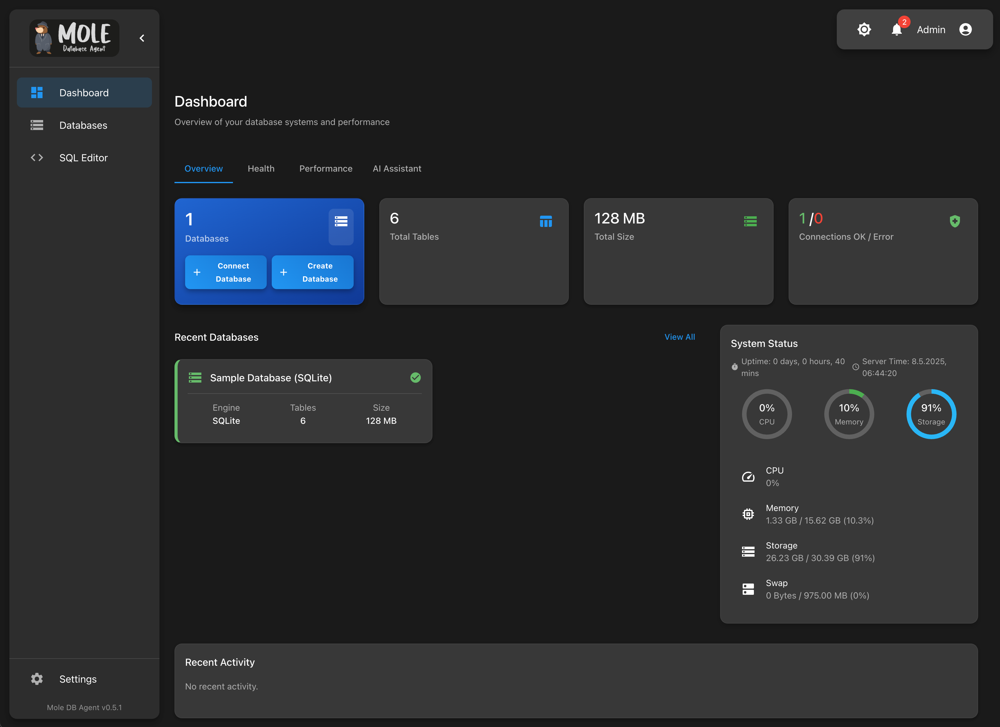
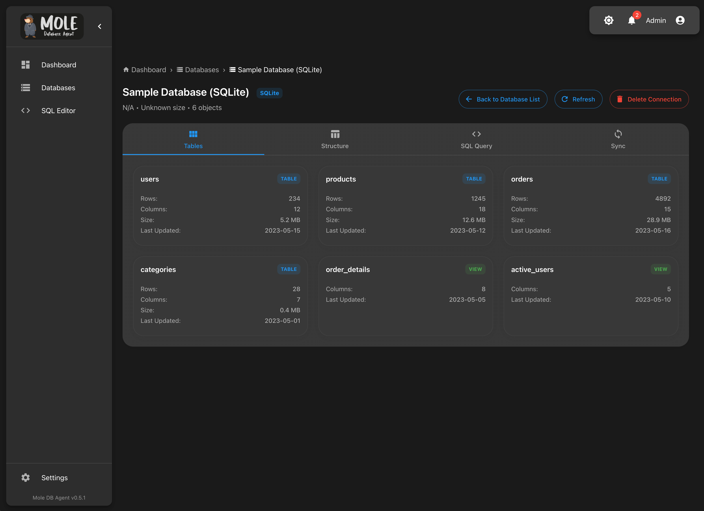
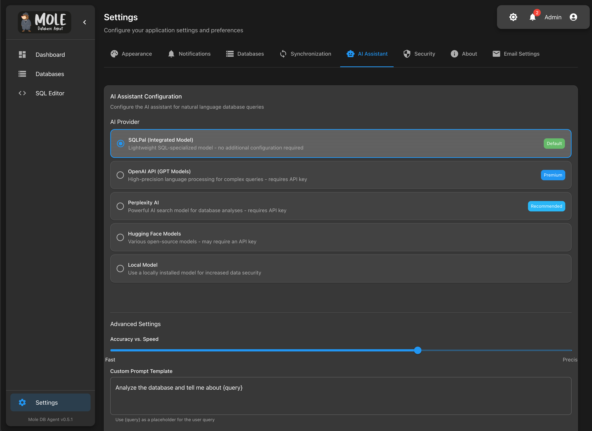

# MOLE - Database Agent


<p align="center">
  
</p>

> A modern, web-based database management tool with a beautiful interface inspired by Apple and Nextcloud design. MOLE allows you to connect to multiple database types, create databases, perform table operations, and synchronize data between different database servers.

## Screenshots

 

 

## Table of Contents
- [Features](#features)
- [Quick Start](#quick-start)
- [Docker Compose Configuration](#docker-compose-configuration)
- [Usage](#usage)
- [Customization](#customization)
- [Architecture](#architecture)
- [License](#license)
- [Acknowledgements](#acknowledgements)

## Features

- **Modern UI**: Clean, modern interface with responsive design
- **Multiple Database Support**: Connect to MySQL, PostgreSQL, and InfluxDB databases
- **Database Creation**: Create new databases directly from the UI
- **Table Management**: Create, modify, and delete tables; add and edit data
- **Database Synchronization**: Schedule and manage database synchronization between servers
- **Customizable**: Easy to customize themes and configuration
- **Advanced Monitoring**: Comprehensive performance metrics, health scores, and visual indicators
- **AI-Powered Analysis**: Ask questions about your database in natural language and get intelligent insights
- **User Authentication**: Secure user login and registration system with JWT authentication
- **Email Notifications**: Configurable SMTP settings for system notification emails

## Quick Start

### Prerequisites

- Docker and Docker Compose v2 installed on your system
- Basic understanding of Docker and database concepts

### Installation

1. Clone this repository:
   ```bash
   git clone https://github.com/your-username/mole.git
   cd mole
   ```

2. Start the MOLE - Database Agent:
   ```bash
   docker compose up -d
   ```

3. Access the web interface at `http://localhost:8080`

4. Login with the default admin account:
   - Email: admin@example.com
   - Password: admin

## Docker Compose Configuration

The Docker Compose file includes the following services:

- **mole-ui**: The web interface based on React with custom styling and enhancements
- **db-sync**: A service for database synchronization
- **mysql**: An example MySQL database (optional)
- **postgres**: An example PostgreSQL database (optional)
- **influxdb**: An example InfluxDB database (optional)

## Usage

### Connecting to a Database

1. Open your browser and navigate to `http://localhost:8080`
2. Login with your credentials or the default admin account
3. Select the database type (MySQL, PostgreSQL, or InfluxDB)
4. Enter the connection details:
   - Server: hostname or IP address
   - Username: database username
   - Password: database password
   - Database: database name (optional)
5. Click "Login"

### Creating a New Database

1. Navigate to the "Create Database" section
2. Select the database type
3. Enter the server details and credentials
4. Specify the database name
5. Click "Create"

### Synchronizing Databases

1. Configure the synchronization in the `db-sync/config/sync.yml` file
2. Enable the sync service in the configuration
3. Specify source and target database connections
4. Configure the synchronization schedule
5. The database sync service will run according to the schedule

### Configuring Email Notifications

1. Navigate to the Settings page
2. Go to the Email section
3. Configure SMTP server details:
   - SMTP Host
   - Port
   - Username/Password
   - Encryption type (TLS/SSL)
4. Set sender name and email address
5. Test the configuration with the "Send Test Email" button

## Customization

### Modifying the Theme

The UI theme can be customized by editing:
- `app/themes/mole/adminer.css`: The main theme CSS
- `app/custom.css`: Additional CSS customizations

### Adding Custom Plugins

You can extend MOLE's functionality by adding plugins to the `app/plugins` directory.

## Architecture

The system consists of several components:

- **mole-ui**: A modern React-based web interface with Material UI styling for database management
- **db-sync**: A Python service that synchronizes data between databases
- **mysql**: A MySQL database server
- **postgres**: A PostgreSQL database server
- **backend**: Node.js Express server providing authentication and email services

### Web UI

The web interface provides an intuitive UI for managing database connections:

- View and manage database connections
- Browse database tables and their contents
- Execute SQL queries directly in the browser
- View query results and export data
- User authentication and profile management
- Email notification configuration

The UI is built with React and Material UI for a modern, responsive experience.

## License

This project is licensed under the MIT License - see the LICENSE file for details.

## Acknowledgements

- Inspired by various database management tools
- Uses React and Material UI for the frontend
- Powered by Python for database synchronization 
- Node.js Express for authentication and email services 

## Keywords
`database-management` `mysql` `postgresql` `influxdb` `react` `node-js` `docker` 
`synchronization` `monitoring` `web-ui` `material-ui` `database-sync` `devops` 
`self-hosted` `open-source` 